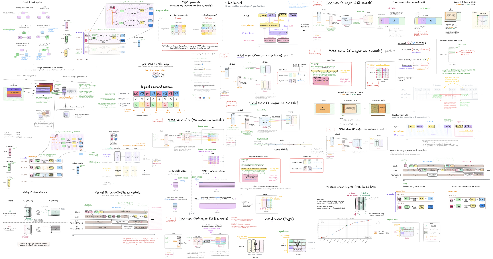
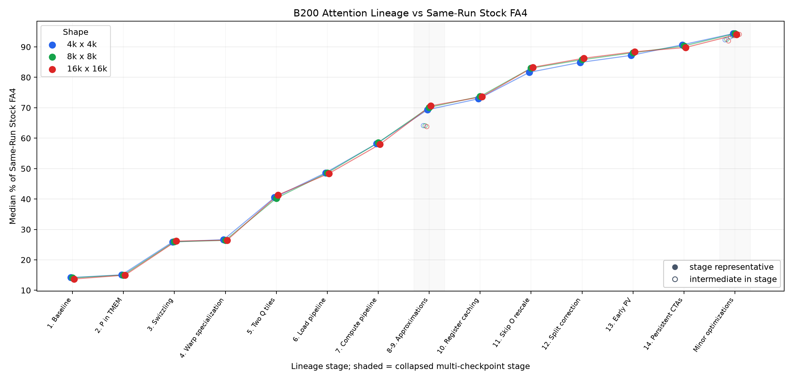

# B200 Attention from Scratch

**14 kernels | 60 diagrams | 94.5% of FlashAttention-4 | video-generation capstone**

<h2 align="center">
  <a href="https://iaroslavelistratov.github.io/b200-attention/">🎨 Read visual guide</a> ·
  <a href="kernels/">⚙️ Browse kernels</a> ·
  <a href="benchmarks/">📊 Check &amp; benchmark</a> ·
  <a href="capstone-project/">🚀 Run capstone</a>
</h2>
<!-- 
<h1 align="center">
  <a href="https://iaroslavelistratov.github.io/b200-attention/">🎨 Read visual guide</a> ·
  <a href="kernels/">⚙️ Browse kernels</a>
</h1>

<h1 align="center">
  <a href="benchmarks/">📊 Check &amp; benchmark</a> ·
  <a href="capstone-project/">🚀 Run capstone</a>
</h1> -->

**Build and understand one of the most complex GPU kernels on the latest hardware.**

A visual, diffable path from scratch to a high-performance NVIDIA B200 kernel.
Each checkpoint is organized around one main optimization, so you can
study the explanation and diff the neighboring source files.

The visual guide introduces Blackwell-specific machinery gradually, with
step-by-step explanations and diagrams. Basic CUDA and matrix-multiplication
familiarity are enough; no prior Blackwell experience is required.

**If you are familiar with basic cuda, you can read and fully understand the blogpost.**

## Performance progression

> Benchmark scope: FA4 and my kernels are benchmarked on their preferred layouts.
> FA4 contiguous on BSHD, and the local kernels on contiguous BHLD.
> Layout conversion was excluded from timing for both.
>
> Also, the local kernels can be easily adapted to natively work on FA4-style BSHD
> (without calling .contiguous() on the inputs).
> I implemented a direct-BSHD version of the final kernel (same modification can be applied
> to any other kernel in the lineage), performance changes only slightly.
> See benchmarks/README.md#input-layout-and-direct-bshd.

## Kernel lineage

- [`kernels/`](kernels/) - 18 numbered checkpoints: 14 main stages followed by
  four smaller optional refinements, plus a direct-BSHD integration variant.

## Capstone: generate videos with your kernel

I strongly recommend doing the capstone after reading the article.
It plugs the B200 attention kernel into a video generation model,
where the model calls **YOUR KERNEL (or the kernel you understand)** 1,056 times
for each generated video.

**[Run the video-generation capstone](capstone-project/)**

## Scope

The kernels implement dense, non-causal forward attention for NVIDIA B200
(`sm_100a`). They use BF16 inputs and outputs, head dimension of 128, KV
lengths that are multiples of 128 (up to 32K seq_len tested, likely will work fine for even longer),
and Q lengths compatible with each checkpoint's one- or two-tile Q staging.

This is a handwritten teaching and research lineage,
not a line-for-line port of the official FlashAttention-4
implementation.
